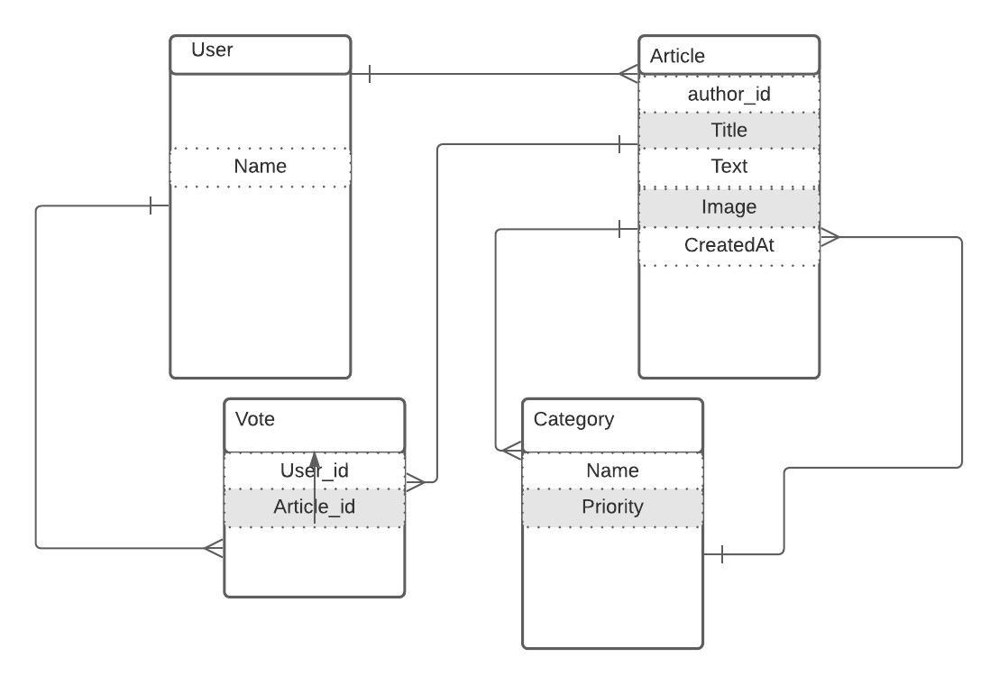

# Article App
It is a web application where every person can write article and share their opinion.

Social media website

> Social Media application. You can sign up with and email and password and then create posts and add others as a friend.

## LIVE DEMO
- HEROKU: [heroku](https://article-application.herokuapp.com)

## Built With

- Ruby v2.7.0

### Prerequisites

- Ruby 2.7.0
- Rails

### Setup
- Refer to the [GitHub Documentation](https://docs.github.com/en/github/creating-cloning-and-archiving-repositories/cloning-a-repository) on how to clone the repo in your preferred method (Through Github desktop or the command line)
- Install gems with:
- with the console still open, type in 'rails db:migrate'
- afterwards type 'rails s'
- Open your browser and in the address bar type 'http://localhost:3000/'
- You should be able to make an account, and write article, comment and vote.

### Tests
- Open your terminal/command/console and type in 'rspec --format documentation' 

### Author
## Deyan Todorov
- 👤GitHub: [deikdesign](https://github.com/deikdesign/)
- Twitter: [@deikdesign](https://twitter.com/deikdesign)

## 🤝 Contributing

Contributions, issues and feature requests are welcome!
Feel free to check the issues page.

## Show your support

Give a ⭐️ if you like this project!

- Microverse
- Github

## Acknowledgments

- [Microverse](https://www.microverse.org/).
